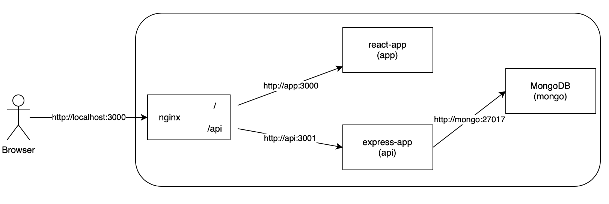

# farm-data-exercise

My submission to the Solita Dev Academy assignment

## Prerequisites

You will need installed on your device:

- [Node.js](https://nodejs.org) and [npm](https://docs.npmjs.com/downloading-and-installing-node-js-and-npm)
- [Docker](https://www.docker.com)
- [Docker-Compose](https://docs.docker.com/compose/install/) (separate installation only required on Linux!)

## Running the project

The following commands install and run the development version of the app. They need to be run in order.

1. Clone the project and move to the project's root direcory

```sh
git clone https://github.com/alandsilva/farm-data-exercise.git
cd farm-data-exercise
```

2. Install node modules

```sh
npm run install:all
```

This should take a few seconds. It installs the node packages in the /backend and /frontend folders. After it is done move to the next step

3. From the project root run

```sh
docker-compose -f docker-compose.dev.yml up
```

This will take a few minutes to complete the first time you run it.
Then from your browser you can access:

- React client from http://localhost:3000
- Interactive OpenAPI documentation and Express API from http://localhost:3000/api (**Note:** You might need to type this url manually because the browser might redirect to https://localhost/api)

## Tests

- Backend tests are availabele. If you haven't done so already. Do steps 1 and 2 from 'Running th project' part above. Then to run the tests, from the project root run:

```sh
docker-compose -f docker-compose.test.yml run test
```

## Closing the containers

After running the project locally, you'll probably have containers running in the background.
Bellow are instructions on closing them:

- To close the development environment containers, from the project root run:

```sh
docker-compose -f docker-compose.dev.yml down --volumes
```

- To close the test environment containers, from the project root run:

```sh
docker-compose -f docker-compose.test.yml down --volumes
```

- Afterwards you can delete the closed containers. The bellow command deletes all closed containers:

```sh
docker rm $(docker ps --filter status=exited -q)
```

- Lastly, you might want to delete the unused images that were created as baselines fo the containers. You can remove all unused images with the command: (**Beware!** The next command will remove all dangling images. You can read more about this [here](https://docs.docker.com/config/pruning/))

```sh
docker image prune -a
```

# Description

This is a full stack web project for visualizing and adding data on farms.
New farm entries can be made either by adding a single entry or by uploading a csv file.

## Features

- You can filter the farms list by several parameters (min and max sensorType and value, date, location)
- You can add a single Farm entry.
- You can upload a csv file with farm data entries.
- Invalid inputs return appropriate error messages.

## Technologies used

### Environment

I used Docker and Docker Compose during development because they provide an easy way to setup a local multi-container development environment.
It also allowed me to start the MongoDB containers (both for development and testing) with some data in them.  
The image bellow represents what the docker development setup is:


### Backend and Frontend

The technologies listed bellow were chosen primarily because I have previous experience using them:

- **Express.js**
- **React** was used to develop the client app. It was chosen because it allows for reusable components, making refactoring simple.
- The programming language on both backend and frontend is **Javascript**. It was choses because it is simpler to develop both sides of the application with the same programming language.
- **MongoDB** was used as the database. It has a pretty straightforward query building system, which was used extensively for filtering the returned results.
- **SwaggerHub** was used to create the OPENAPI documentation. It provides an interactive environment for trying out the API.
